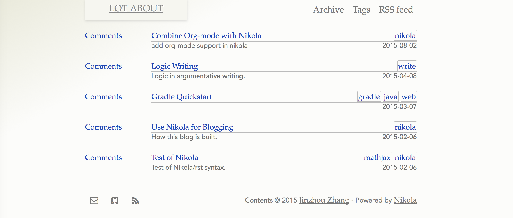
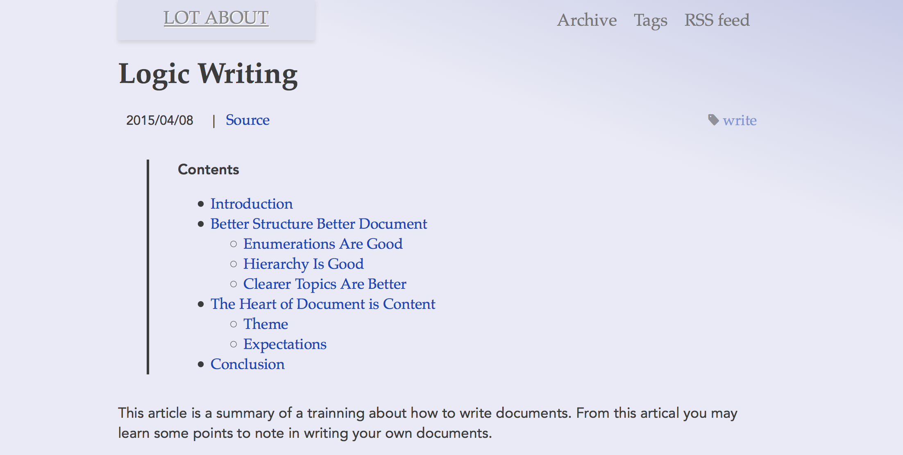

Thanks to [flasky](https://github.com/fjavieralba/flasky) and
[Wu](https://github.com/rykka/wu). This theme trys to introduce the beautiful
theme into nikola.

# How to use it?
1. Download this repository and put it under '<your blog source>/themes/' folder.
2. Modify your `conf.py` and set `THEME = "zzz"`.
3. Done!

## About the post
Note that the index page will show a short description of your post, that is
manually added by you with the 'description' attribute:
```
.. title: Test of Nikola
.. slug: test-of-nikola
.. date: 2015-02-06 10:42:28 UTC+08:00
.. tags: nikola, mathjax
.. category: unknown
.. link:
.. description: Test of Nikola/rst syntax.
.. type: text
```

# Additional Hack
## Footer
The footer can include several icons(email, github, twitter, rss) according to
your settings. Put the settings in `GLOBAL_CONTEXT` variable in `conf.py`.
Example:
```
GLOBAL_CONTEXT = {
    'email': 'lotabout@gmail.com',
    'github': 'lotabout',
}
```

## Color
Also, the theme has several preset color themes, it will be automatically set
according to the tags of your post. However, you should specify what color for
what tag:
```
GLOBAL_CONTEXT = {
    'theme_tag': {'green':'tech','blue':'write','red':'life'},
}
```
In the above setting, if a post had a tag of 'tech', the page will show up in
'green' theme.

gray, blue, gree, red themes are supported.

# Well, ScreenCast
The index of my [blog](https://lotabout.github.io)

The blue theme(maybe not that blue)


# License
Well, better add this, I choose MIT license for this theme. Only because
[chooselicense](http://choosealicense.com/) says it is simple and permissive.

Enjoy the theme.
